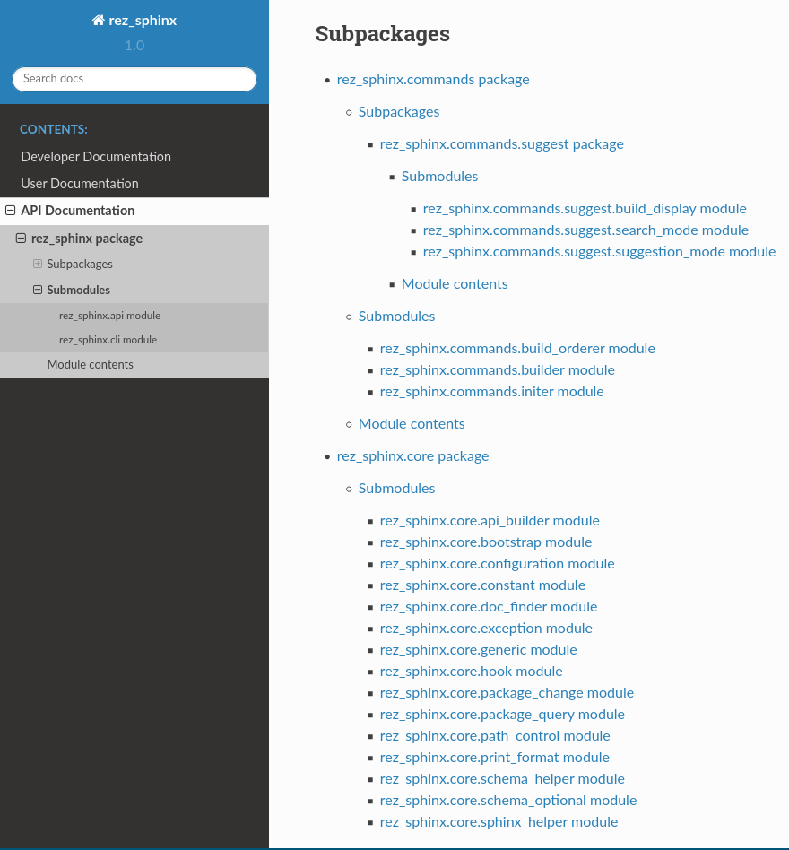

.. _rez_sphinx build:

################
rez_sphinx build
################

This parent command includes building documentation but also things like
inspecting the built documentation and any other possible future commands.

Another related command, :ref:`rez_sphinx view sphinx-config`, is very useful
for debugging builds.

.. _rez_sphinx build run:

rez_sphinx build run
********************

This command takes documentation built using :ref:`rez_sphinx init` and
generates .html. The basic steps go as follows

- Check that all :ref:`default file entries` have hand-written documentation
    - This check is disabled via :ref:`rez_sphinx.init_options.check_default_files`.
- As long as ``--no-apidoc`` isn't specified and API generation is allowed
    - Auto-create .rst files using ``sphinx-apidoc``.
    - Add the root `modules.rst`_ to the master `index.rst`_ file.
- Run ``sphinx-build``

The documentation is either available in ``{root}/documentation/build`` (the
default location) or ``{root}/build/documentation`` if you passed you passed
``rez_sphinx init --quickstart-arguments="--no-sep"``.

.. _rez_sphinx apidoc templates:

A note about Python 2 / 3
*************************

The default toctree generated for the API documentation is super ugly.

Starting from Sphinx 2.2+, which requires Python 3, the same toctree looks like this:

So in short, if you want a pretty toctree, run :ref:`rez_sphinx` in Python 3.
If you prefer the default tree, this behavior can be disabled using
:ref:`rez_sphinx.sphinx-apidoc.allow_apidoc_templates`.
