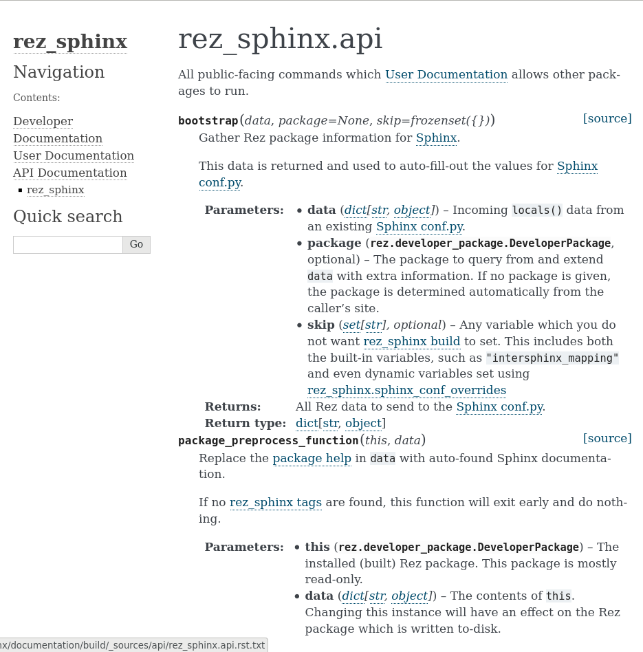

######################
Using sphinx-rtd-theme
######################

TODO make sure the tutorials in this page work
TODO make sure that scope("config") doesn't accidentally apply to downstream Rez packages

`readthedocs.io`_ has been a huge boon for the Python community. Its website
front end for hosting documentation is a fantastic resource. It also open
sourced a `sphinx theme`_ called `sphinx-rtd-theme`_.

Here's what the default sphinx theme, `alabaster`_ looks like:

And here's the same page, using `sphinx-rtd-theme`_.

.. image:: images/sphinx_rtd_theme_example_page.png

:ref:`rez_sphinx build run` supports changing your documentation theme on the fly.

Modifying Your Sphinx Theme
***************************

Themes can be editted globally, across all Rez packages, or modified within
individual Rez packages. Here's how.

.. _globally_choosing_a_sphinx_theme:

Globally Choosing A Sphinx Theme
********************************

TODO make sure this tutorial works

Define a `rezconfig.py`_ like you normally would and add this block into it.

.. code-block:: python

    optionvars = {
        "rez_sphinx": {
            "extra_requires": ["sphinx_rtd_theme-1+<2"],
            "sphinx_conf_overrides": {
                "html_theme": "sphinx_rtd_theme",
            },
        },
    }

If you haven't installed sphinx-rtd-theme as a Rez package before, do so before
continuing.

.. code-block:: sh

   rez-pip --install sphinx-rtd-theme==1.0.0 --python-version=2 --release
   rez-pip --install sphinx-rtd-theme==1.0.0 --python-version=3 --release

You're ready to build. If you haven't set up your documentation once before,
follow the steps in :doc:`getting_started`. Otherwise, run your usual build
command:

.. code-block:: sh

   rez-test your_package_name_here build_documentation

Now your documentation should be running the `sphinx-rtd-theme`_.

.. _locally_choosing_a_sphinx_theme:

Locally Choosing A Sphinx Theme
*******************************

Use A Local rezconfig.py
------------------------

If you want a theme on a specific Rez package and you don't want enforce it
across all users, you have two options:

- Repeat the same steps in :ref:`globally_choosing_a_sphinx_theme` but, instead
  of installing `rezconfig.py`_ in a central location, just write the file to
  your local user anywhere. Like ``~/rezconfig.py``.
- When building, run
  ``REZ_CONFIG_FILE=~/rezconfig.py rez-test your_package_name_here build_documentation``

.. _define_a_scoped_package_config:

Define a scoped package config
------------------------------

TODO : Make sure this works!

If you don't like all that typing (I don't blame you) or want something more
permanent that persists on a Rez package, there's another option. In your
`package.py`_ add this:

.. code-block:: python

    with scope("config") as config:
        config.optionvars.update(
            {
                "rez_sphinx": {
                    "extra_requires": ["sphinx_rtd_theme-1+<2"],
                    "sphinx_conf_overrides": {
                        "html_theme": "sphinx_rtd_theme",
                    },
                },
            }
        )

Now you can just run ``rez-test your_package_name_here build_documentation``
without worry. Even if someone else builds the Rez package, this will still work.

Parting Thoughts
================

If you can define the theme globally, :ref:`globally_choosing_a_sphinx_theme`
is usually the best option. However if you need a local solution, I highly
recommend :ref:`define_a_scoped_package_config` over
:ref:`locally_choosing_a_sphinx_theme` because it has the most consistent
results across multiple users. Albeit at the expense of more hard-coding into
the Rez package.

That's a lot to know. The lengths mankind goes just for a few pretty colors,
am I right?

Anyway, :ref:`rez_sphinx` actually has a ton of configuration settings like
this one. To learn more, see :doc:`configuring_rez_sphinx`.
